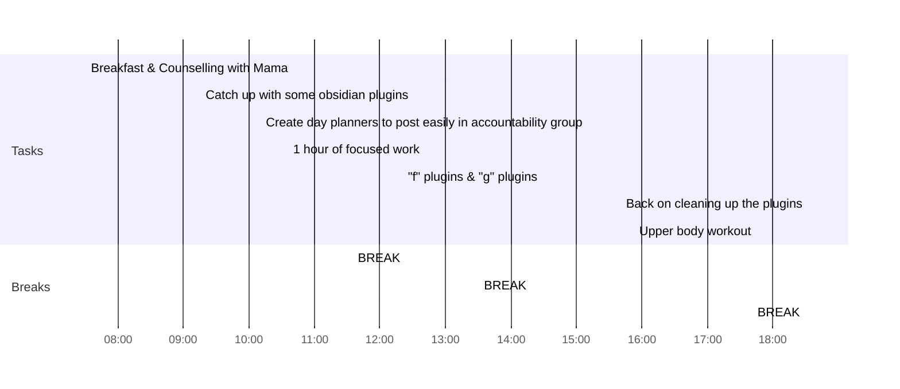

---
aliases:
tags: 
---

---
## Day Planner

### Morning Routine
- [x] 07:30 Breakfast & Counselling with Mama
  

### Focus 1
- [x] 09:15 Catch up with some obsidian plugins
- [x] 10:10 Create day planners to post easily in accountability group
- [x] 10:35 1 hour of focused work
- [x] 11:35 BREAK

### Focus 2
- [x] 12:20 "f" plugins & "g" plugins
- [x] 13:30 BREAK

### Evening Routine
- [x] 15:40 Back on cleaning up the plugins
- [x] 17:45 Upper body workout
- [x] 18:30 BREAK
- [x] 23: 59 END

