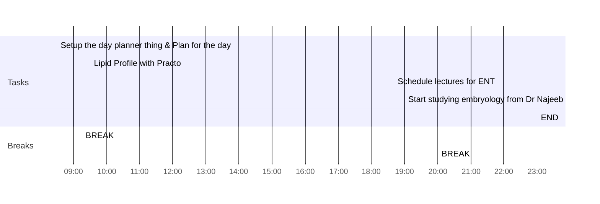

---
### The Green Room
Found the most well maintained & the most sincere snooker club I could have ever imagined, it's called the "The Green Room".

The owner, [[Himanshu Yadav]] is very professional & the players are very good.
Yes, Anne, I am here. This was me responding to anne & angela who mentioned me in great hall. Then I slept, practo guy called me for the sample collection & so, I'm up at 08:36

### Morning Mindset
- *Sleep* .... It was good I forgot to take Mirtaz & Nexito, had a calcium deficiency dream about Moma
- *Feeling* ...  🥳 Happy
	- Snooker thing is awesome!
- *Looking forward for* - Playing Snooker with Gaurav of A502
- *Might trip me out* - Excessive procrastination
	- **Deal by**  I will start studying right now
- [x] *I can show my gratitude to* Moma, I can video call

### Focus
- *One phrase to rule them all* - Motivated
- *Eagle's eye view* - I have the time, don't panic

Overheard Mama saying to Mami, that "Jabse woh sorry bola hai (referrring to the discussion with Me, Moma, Daddy, Mami & Mama), I feel good & better about things."

Also these days, me & Mami do a bit of meal planning every week & Mami said, that this has improved her life & reduced her stress levels considerably.

**So, I am feeling very good about myself this morning.**

### Afternoon thoughts
- **Feeling 😤 Lazy | I have not studied at all & wasted the entire day again
- Checking in for the day
	- Day is going **Worse than expected**
#### Note to next day’s self

### Consume
### Cerebrate

--- 
### Day Planner

#### Morning Routine
Assorted paranthas in breakfast, but waiting for the lipid profile thing
- [x] 08:30 Setup the day planner thing & Plan for the day
- [x] 09:30 Lipid Profile with Practo
- [x] 09:15 BREAK

#### Evening Routine
- [ ] 18:40 Schedule lectures for ENT
- [ ] 19:00 Start studying embryology from Dr Najeeb
- [ ] 20:00 BREAK

#### Night Routine
- [ ] 
- [ ] BREAK
- [ ] 
- [ ] 23:00 END

