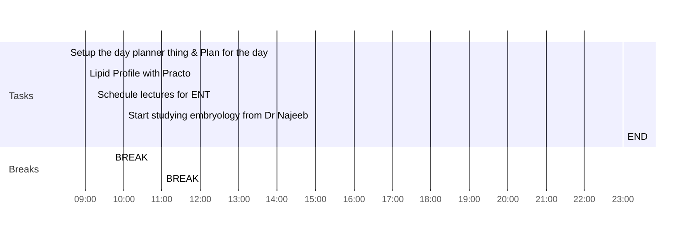

---
### The Green Room
Found the most well maintained & the most sincere snooker club I could have ever imagined, it's called the "The Green Room".

The owner, [[Himanshu Yadav]] is very professional & the players are very good.
Yes, Anne, I am here. This was me responding to anne & angela who mentioned me in great hall. Then I slept, practo guy called me for the sample collection & so, I'm up at 08:36

### Connect 
#### Note to next day’s self
### Consume
### Cerebrate

--- 
### Day Planner

#### Morning Routine
- [ ] 08:30 Setup the day planner thing & Plan for the day
- [ ] 09:00 Lipid Profile with Practo
- [ ] 09:13 Schedule lectures for ENT
- [ ] 09:40 BREAK
  

#### Focus 1
- [ ] 10:00 Start studying embryology from Dr Najeeb
- [ ] 11:00 BREAK

#### Focus 2
- [ ] 
- [ ] BREAK

#### Evening Routine
- [ ] 
- [ ] BREAK

#### Focus 3
- [ ] 
- [ ] BREAK

#### Night Routine
- [ ] 
- [ ] BREAK
- [ ] 
- [ ] 23:00 END

### Daily Activity 
###### Activity Grading
| Activity | Time Given | Fun | Satisfaction |
| -------- | ---------- | --- | ------------ |
|  |            |     |              |

###### Notes Created Today
###### Notes Modified Today 

