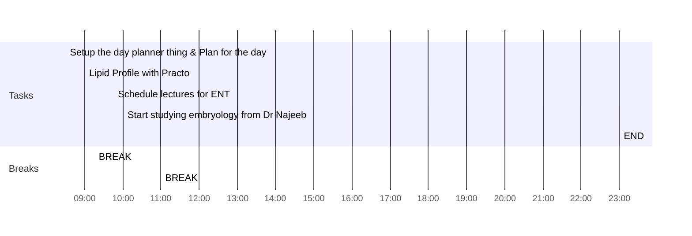

---
### The Green Room
Found the most well maintained & the most sincere snooker club I could have ever imagined, it's called the "The Green Room".

The owner, [[Himanshu Yadav]] is very professional & the players are very good.
Yes, Anne, I am here. This was me responding to anne & angela who mentioned me in great hall. Then I slept, practo guy called me for the sample collection & so, I'm up at 08:36

### Connect 
Overheard Mama saying to Mami, that "Jabse woh sorry bola hai (referrring to the discussion with Me, Moma, Daddy, Mami & Mama), I feel good & better about things."

Also these days, me & Mami do a bit of meal planning every week & Mami said, that this has improved her life & reduced her stress levels considerably.

**So, I am feeling very good about myself this morning.**
#### Note to next day’s self
### Consume
### Cerebrate

--- 
### Day Planner

#### Morning Routine
Assorted paranthas in breakfast, but waiting for the lipid profile thing
- [ ] 08:30 Setup the day planner thing & Plan for the day
- [ ] 09:00 Lipid Profile with Practo
- [ ] 09:15 BREAK
  

#### Focus 1
- [ ] 09:45 Schedule lectures for ENT
- [ ] 10:00 Start studying embryology from Dr Najeeb
- [ ] 11:00 BREAK

#### Focus 2
- [ ] 
- [ ] BREAK

#### Evening Routine
- [ ] 
- [ ] BREAK

#### Focus 3
- [ ] 
- [ ] BREAK

#### Night Routine
- [ ] 
- [ ] BREAK
- [ ] 
- [ ] 23:00 END

