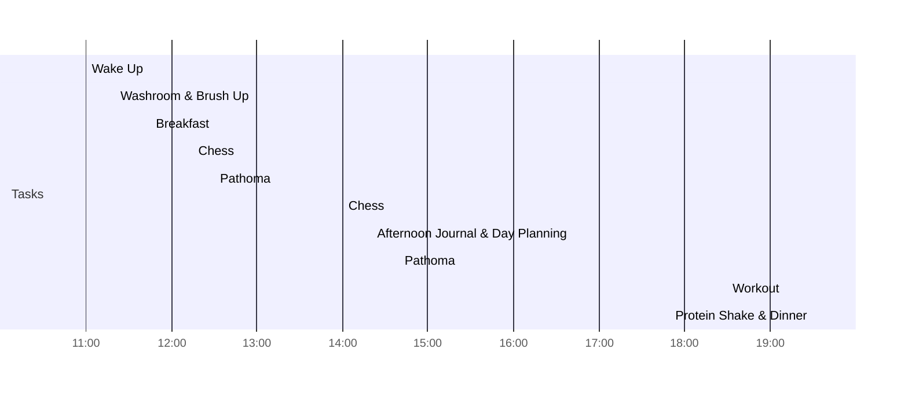

### Late Morning

- **Feeling** 😤 Lazy|Not sure why
- Sleep
	- It was not so good but I don't remember the contents of the sleep
	- I can be Intentional about sleeping try not to stay late to get work done,  try to do it in the day itself

### Connect 
### Consume
<iframe width='100%' height='450' src='https://www.youtube.com/embed/eWPMY16qoq0' frameborder='0' allow='accelerometer; autoplay; clipboard-write; encrypted-media; gyroscope; picture-in-picture' allowfullscreen style='border: 3px solid #ffbaeb;'></iframe>
### Cerebrate
### Note to next day’s self
--- 
### Day Planner

- [x] 11:00 Wake Up
- [x] 11:20 Washroom & Brush Up
- [x] 11:45 Breakfast
- [x] 12:15 Chess
- [x] 12:30 Pathoma
- [x] 14:00 Chess
- [ ] 14:20 Afternoon Journal & Day Planning
- [ ] 14:40 Pathoma
- [ ] 18:30 Workout
- [ ] 19:30 Protein Shake & Dinner
