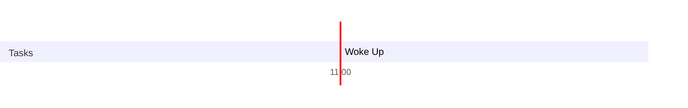

### Pathoma Rundown 
- Total lecture duration → 35 Hr 
- Time it takes me to get through 1 lecture → 1.3x → 35×1.4 → 56 Hr
- Total Anki Cards → 8200
- As of now 23-May-22 
	- I need to cover 45 more hours of lectures
	- I have unsuspended roughly 200 cards, so a lot more to go there
- Everyday I need
	- 1 hour for Anki
	- 1 hour for first aid
	- 1 hour of reading previous lecture notes + what I studied today 
- If I study for 8 hours a day I can watch new lectures for 5 hours a day
	- So 9 more days to go, let's give it 10 → 2nd June & I will be done
		- I started thinking about pathoma on 11th May, but these 11 days, I was not super good, so all in all finishing pathoma, with first aid & anki in 20 days
### Note to next day’s self
--- 
### Day Planner

- [x] 11:00 Woke Up
