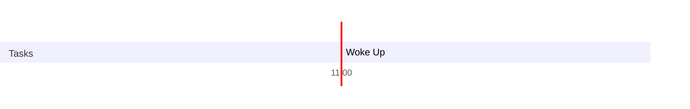

### Pathoma Rundown
- Total lecture duration → 35 Hr 
- Time it takes me to get through 1 lecture → 1.3x → 35×1.4 → 50 Hr
- Total Anki Cards → 8200
- As of now 23-May-22 
	- I need to cover 40 more hours of lectures
	- I have unsuspended roughly 200 cards, so a lot more to go there
- Everyday I will be needing to do 2 hour of revision
- If I study for 8 hours a day 
### Note to next day’s self
--- 
### Day Planner

- [x] 11:00 Woke Up
