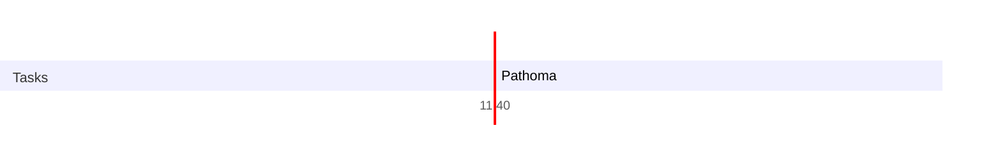

### Lazy Morning
Woke up at 10:00 & very lazy, don't feel like doing the whole morning journal thing from ipad, so added a task to create a quickadd macro out of it, that should be good!

I can't get over the fact that howard dies & that too, killed by lalo, I am not liking Jimmy & Kim now. Will have to wait till July 12 when the next episode comes out

Starting with pathoma today, so as to complete the target for starting the paperwork for my loan.

- Will probably not do day planner today, since I am already doing it in Marvin. This duplicitiy of apps is something I would like to eliminate in the future.
	- Time tracking
		- Productivity Challenge Timer
		- Toggl Track
	- Task & Project Management
		- Marvin
	- Journaling
		- Oobsidian
		- Notion
	- Day Planning/Timeblocking
		- Marvin
		- Obsidian

### Connect 
### Consume
### Cerebrate
### Note to next day’s self
--- 
### Day Planner

It is 11:32 now & I am starting with Pathoma finally

- [x] 11:40 Pathoma

