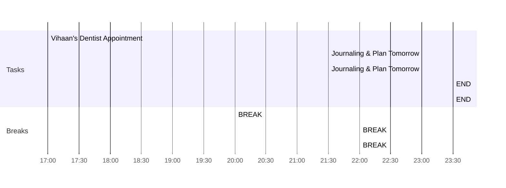
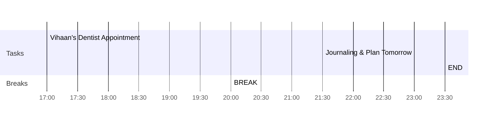

### Morning Pages
nothing
### Good Morning
- How was sleep → It was awesome, I got up at the night, richie rich was snoring, ginney was roaming, I took water, splashed it at ginney & then slept again.
- I can get excited about →  Ohhh, that dress nihit's aunt sent me is arriving today
- One phrase to rule them all → super fit anne
- I can be cautious about → sitting all day at my computer sounds really boring, I am might get tired & really really sad about it, I will go out & play volleyball
- Eagle's eye view → Hey, I am looking at you from a high level & I can still see you, how big are you?
- Daring Task → If I can sit at my computer & just write 1000 words

### Connect
- 21:21 → Anne took me from one of her screen & put me with Dr Marvin, while telling him that she is doing that.
	- So, I guess University of Illinois is out from my list

### Catching up with everything journaling
- Cleaned up my phone
- Notion Journal is caught up
- Don't have much to write or I am not willing to write 
- Listening & watching Fareed Ayaz & Abu Mohd perform in the famous hongkong video → [[Mera Piya Ghar Aaya]]
- Going back to marvin now

### Day Planner

- [x] 17:00 Vihaan's Dentist Appointment
- [x] 20:00 BREAK
	- [x] 20:00 Anne & The Kids
- [x] 22:30 Dinner
- [x] 22:00 BREAK
	- [x] 22:50 Anne & Journal Prompts
- [x] 23:30 END

